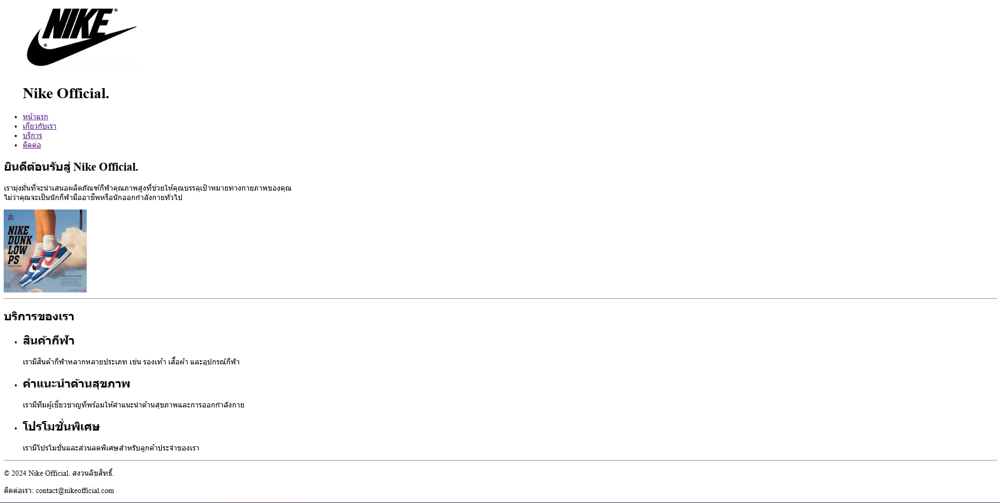
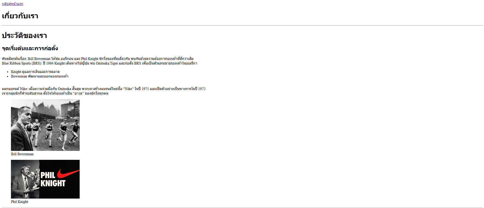
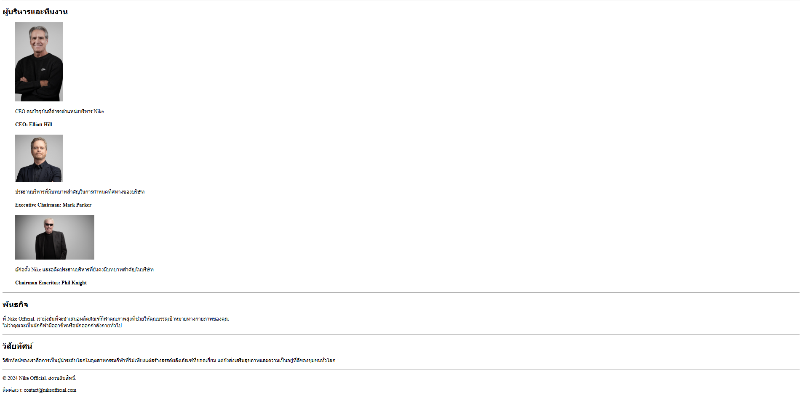
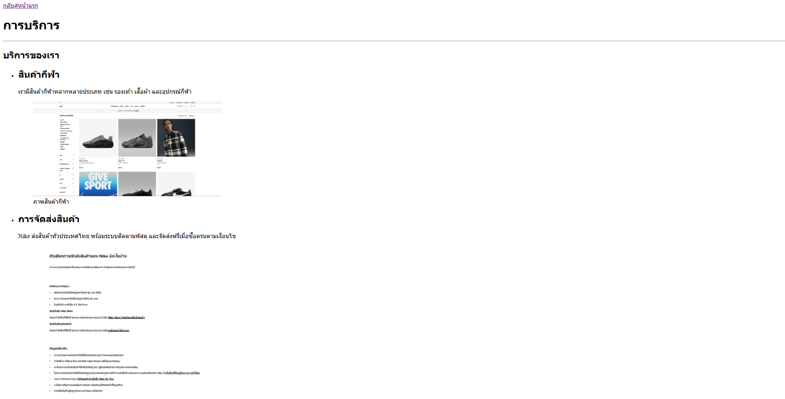
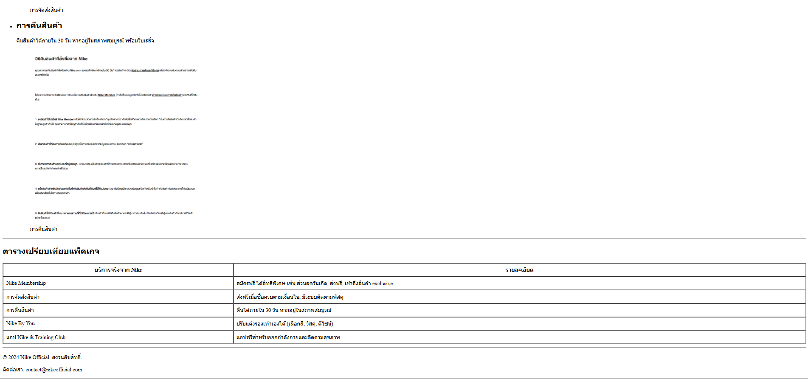
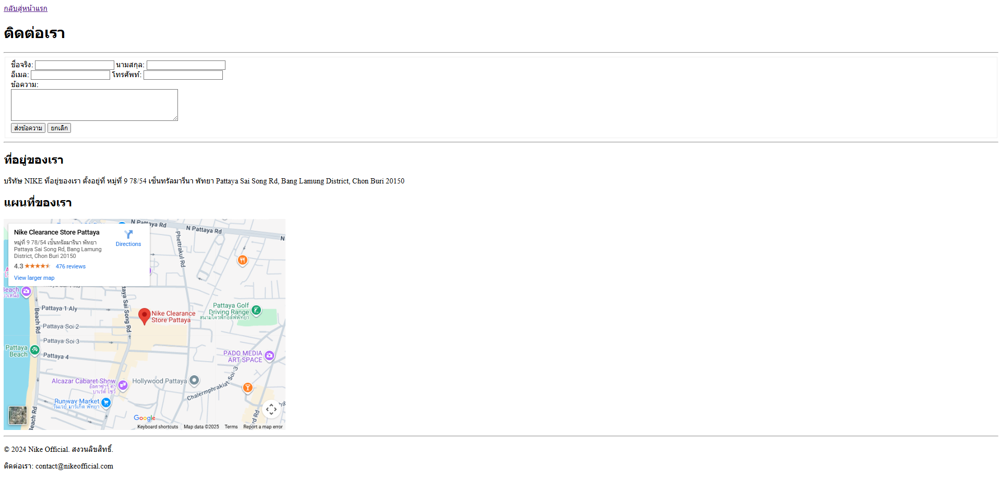

# Nike Official.

โปรเจคเว็บโซต์สำหรับธุรกิจ **Nike Official. ถูกออกแบบมาเพื่อแสดงข้อมูลสินค้า บริการ และช่องทางการติดต่อของแบรนด์ Nike อย่างครบถ้วน**

ประกอบด้วย

- **วิสัยทัศน์** วิสัยทัศน์ของเราคือการเป็นผู้นำระดับโลกในอุตสาหกรรมกีฬาที่ไม่เพียงแต่สร้างสรรค์ผลิตภัณฑ์ที่ยอดเยี่ยมแต่ยังส่งเสริมสุขภาพและความเป็นอยู่ที่ดีของชุมชนทั่วโลก
- **บริการ** สินค้ากีฬา (Sporting Goods),การจัดส่งสินค้า (Shipping), การจัดส่งสินค้า (Returns)
- **ประวัติย่อ** จุดเริ่มต้นของ คน 2 ที่ต้องการสิ่งที่ดีขึ้น พัฒนาสิ่งต่างจนออกมาเป็นบริษัท
- **ตารางเปรียบเทียบ** จุดเปรียบเทียบของสมาชิกต่างที่ผู้สมัครจะได้รับ เป็นประโยชน์ต่อผู้สมัครไปมากน้อยแค่ไหน
- **การติดต่อ** รวามช่องทางติดต่อและแผนที่เดินทางไปบริษัท

## ลิงก์เข้าสู่หน้าเว็บ

- [หน้าแรก](index.html)
- [เกี่ยวกับเรา](about.html)
- [บริการของเรา](services.html)
- [ติดต่อเรา](contact.html)

```text
my-business-web/
├── index.html
├── about.html
├── services.html
├── contact.html
├── css/
│ └── styles.css
├── README.md
└── images/
    ├── logo.jpg
    ├── hero-bg.jpg
    ├── CEO-1.jpg
    ├── ...
    └── Screenshot-index.png
```

## CSS Checklist

- [x] Universal Selector & Reset (`*`)
- [x] Element Selectors (`h1–h4`, `p`, `a`, `table`)
- [x] Class Selectors (`.hero`, `.card`, `.btn`)
- [x] ID Selectors (`#header`, `#footer`)
- [x] Pseudo-classes (`:hover`, `:nth-child`)
- [x] CSS Units (`px`, `rem`, `%`, `vh`)
- [x] Color Palette & Typography
- [x] Box Model (`padding`, `margin`, `border`)
- [x] Positioning (`sticky`, `fixed`)
- [x] Display & Layout (Flexbox, Grid Layout)
- [x] Hover Effects & Transitions
- [x] CSS Organization & Comments

---

ลิงค์เข้าหน้าเว็บไซต์

[หน้าแรก](index.html)


[เกี่ยวกับเรา](about.html)



[บริการ](service.html)



[ติดต่อเรา](contact.html)


**จัดทำโดย:** 67160197@go.buu.ac.th
